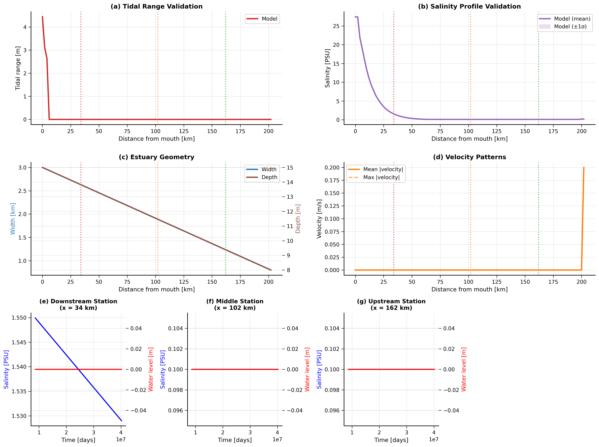
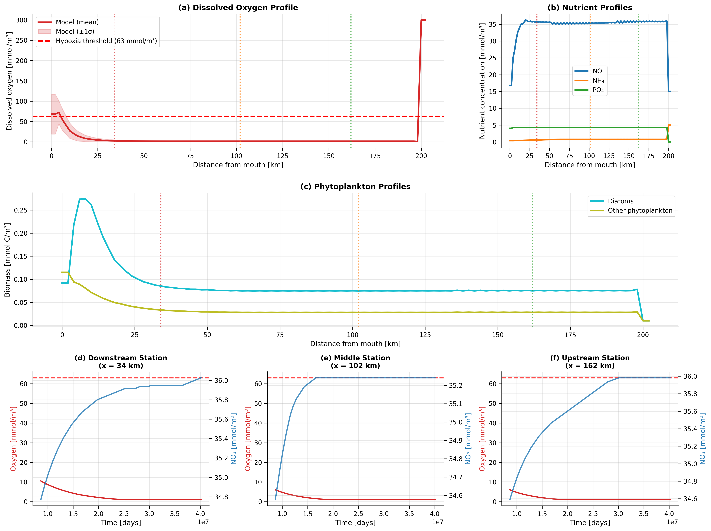

*Figures last generated on 2025-08-12*

How to analyze and visualize JAX C-GEM simulation outputs.

> **Note**: Figures in this document are automatically updated when you run:
> ```bash
> python tools/docs/update_docs_with_figures.py
> ```
> This ensures documentation always shows your latest simulation results.

## Comprehensive Visualization Suite

JAX C-GEM includes a powerful suite of visualization and analysis tools:

| Tool | Description | Typical Use Case |
|------|-------------|-----------------|
| **show_results.py** | Interactive dashboard with summary plots | Quick overview of simulation results |
| **publication_output.py** | Multi-panel publication-quality figures | Journal paper figures with field data validation |
| **model_validation_statistical.py** | Comprehensive statistical validation | Quantitative model assessment with metrics |
| **validate_against_field_data.py** | Field data comparison | Validation against observed data |

### Publication-Quality Figures



 Comprehensive validation of hydrodynamics and transport processes. (a) Tidal range longitudinal profile comparing model results (red line) with field observations (red dots). (b) Salinity longitudinal profile showing model mean (purple line) with variability band (shaded) and observations (pink dots). (c) Estuary geometry showing width (blue) and depth (brown) profiles used in the model. (d) Velocity patterns showing mean and maximum absolute velocities along the estuary. (e-g) Time series of salinity (blue) and water level (red) at three representative stations: downstream, middle, and upstream. Vertical dashed lines in panels (a-d) show station locations.



 Comprehensive water quality analysis showing spatial patterns and temporal dynamics. (a) Dissolved oxygen longitudinal profile with model mean (red line), variability (shaded), hypoxia threshold (dashed line), and field observations (orange dots). (b) Nutrient concentration profiles for nitrate (blue), ammonium (orange), and phosphate (green). (c) Phytoplankton biomass profiles showing diatoms (cyan) and other phytoplankton (olive). (d-f) Time series of dissolved oxygen (left axis) and nitrate (right axis) at three stations: downstream, middle, and upstream. Vertical dashed lines in panels (a-c) show station locations.

## Output Files

After running a simulation, you'll find results in the `OUT/` directory:

```
OUT/
├── simulation_results.npz         # Main simulation data 
├── Reaction/                      # Reaction outputs (optional)
├── Publication/                   # Auto-generated figures
│   ├── figures/                   # PNG and PDF figures
│   │   ├── figure_1_hydrodynamics_transport_comprehensive.png
│   │   ├── figure_1_hydrodynamics_transport_comprehensive.pdf
│   │   ├── figure_2_water_quality_comprehensive.png
│   │   └── figure_2_water_quality_comprehensive.pdf
│   ├── README.md                  # Documentation of figures
│   ├── figure_captions.txt        # Ready-to-use captions
│   ├── supplementary/             # Supplementary figures
│   └── tables/                    # Data tables
├── Statistical_Validation/        # Statistical analysis
│   ├── validation_report.md       # Detailed metrics report
│   ├── salinity_comprehensive_validation.png
│   ├── oxygen_comprehensive_validation.png
│   └── tidal_range_comprehensive_validation.png
├── Validation/                    # Field data validation
└── Advanced_Benchmarks/           # Comparison with other models
```

## Loading Results

### NPZ Format (Recommended)

**Load simulation data:**
```python
import numpy as np

# Load results
results = np.load('OUT/simulation_results.npz')

# See what variables are available
print("Available variables:", results.files)

# Load specific variables
time = results['time']           # Time points (days)
distance = results['distance']   # Spatial grid (meters)
elevation = results['elevation'] # Water levels (m)
velocity = results['velocity']   # Flow velocities (m/s) 
salinity = results['salinity']   # Salt concentration (psu)
temperature = results['temperature'] # Water temperature (°C)

# Biogeochemical variables
nh4 = results['NH4']             # Ammonium (mmol/m³)
no3 = results['NO3']             # Nitrate (mmol/m³)
o2 = results['O2']               # Dissolved oxygen (mmol/m³)
phy1 = results['PHY1']           # Diatoms (mmol/m³)
phy2 = results['PHY2']           # Green algae (mmol/m³)

print(f"Simulation: {len(time)} time steps, {len(distance)} grid points")
```

**Data structure:**
- `time`: Shape `(n_time_steps,)` - Time in days from start
- `distance`: Shape `(n_grid_points,)` - Distance from mouth (meters)  
- All other variables: Shape `(n_time_steps, n_grid_points)` - Time series at each location

### CSV Format

For CSV output, two main files are created:

**`OUT/hydrodynamics_YYYYMMDD_HHMMSS.csv`:**
```csv
time,distance,elevation,velocity,salinity,temperature
0.0,0.0,4.43,0.12,35.0,25.0
0.0,2000.0,4.42,0.15,34.8,24.9
0.0,4000.0,4.41,0.18,34.6,24.8
...
```

**`OUT/water_quality_YYYYMMDD_HHMMSS.csv`:**
```csv
time,distance,NH4,NO3,PO4,SIO4,PHY1,PHY2,ZOO,DET,DIC,O2,...
0.0,0.0,2.5,15.0,1.2,20.0,0.1,0.05,0.02,5.0,2100,250,...
0.0,2000.0,2.3,14.8,1.1,19.5,0.12,0.06,0.02,4.8,2095,248,...
...
```

## Visualization Tools

JAX C-GEM provides several powerful visualization tools to analyze and present simulation results:

### 1. Interactive Results Dashboard

```bash
python tools/plotting/show_results.py
```

*Note: This creates an interactive dashboard that opens in a separate window*

This creates a comprehensive interactive dashboard with:
- 9-panel overview of key simulation variables
- Longitudinal profiles of water level, salinity, velocity
- Time series at mouth, middle, and head of estuary
- Salt intrusion analysis
- Tidal range calculation
- Real-time physics validation
- Statistical summary of model performance

### 2. Publication-Quality Figures

```bash
python tools/plotting/publication_output.py --results-dir OUT --field-data-dir INPUT/Calibration --output-dir OUT/Publication
```

Creates comprehensive multi-panel figures in both PNG and PDF formats:

**Figure 1: Hydrodynamics & Transport**
- Panel A: Tidal range validation with field observations
- Panel B: Salinity longitudinal profile with variability
- Panel C: Estuary geometry (width and depth)
- Panel D: Velocity patterns along the estuary
- Panels E-G: Time series at three key stations

**Figure 2: Water Quality**
- Panel A: Oxygen longitudinal profile with field data
- Panel B: Nutrient profiles (NO₃, NH₄, PO₄)
- Panel C: Phytoplankton spatial distribution
- Panels D-F: Water quality time series at three stations

### 3. Field Data Validation

```bash
python tools/validation/validate_against_field_data.py --results-dir OUT --field-data-dir INPUT/Calibration --output-dir OUT/Validation
```

Compares model outputs against multiple field datasets:
- CEM tidal range observations
- CARE water quality measurements
- SIHYMECC tidal observations
- Generates comparison plots and validation metrics

### 4. Statistical Model Validation

```bash
python tools/validation/model_validation_statistical.py
```

Performs comprehensive statistical validation:
- Root Mean Square Error (RMSE)
- Nash-Sutcliffe Efficiency (NSE)
- R² correlation coefficient
- Percent bias
- Statistical significance tests
- Residual analysis

## Key Variables Explained

### Hydrodynamics

| Variable | Units | Description |
|----------|-------|-------------|
| `elevation` | m | Water surface elevation above datum |
| `velocity` | m/s | Flow velocity (positive = seaward) |
| `salinity` | psu | Salt concentration (0 = fresh, 35 = seawater) |
| `temperature` | °C | Water temperature |

### Biogeochemistry (17 Species)

**Nutrients:**
- `NH4` - Ammonium (mmol N/m³)
- `NO3` - Nitrate (mmol N/m³)  
- `PO4` - Phosphate (mmol P/m³)
- `SIO4` - Silicate (mmol Si/m³)

**Primary Producers:**
- `PHY1` - Diatoms (mmol C/m³)
- `PHY2` - Green algae (mmol C/m³)

**Other Components:**
- `ZOO` - Zooplankton (mmol C/m³)
- `DET` - Detritus (mmol C/m³)
- `O2` - Dissolved oxygen (mmol O₂/m³)
- `DIC` - Dissolved inorganic carbon (mmol C/m³)

## Data Analysis Examples

### Time Series Analysis

```python
import matplotlib.pyplot as plt

# Load data
results = np.load('OUT/simulation_results.npz')
time = results['time']
salinity = results['salinity']

# Plot salinity at mouth (index 0) and head (index -1)
plt.figure(figsize=(10, 6))
plt.plot(time, salinity[:, 0], label='Mouth')
plt.plot(time, salinity[:, -1], label='Head')
plt.xlabel('Time (days)')
plt.ylabel('Salinity (psu)')
plt.title('Salinity Time Series')
plt.legend()
plt.grid(True)
plt.show()
```

### Spatial Profiles

```python
# Plot spatial profile at different times
distance = results['distance'] / 1000  # Convert to km

plt.figure(figsize=(10, 6))
plt.plot(distance, salinity[0, :], label='Day 1')
plt.plot(distance, salinity[100, :], label='Day 100')
plt.plot(distance, salinity[-1, :], label='Final day')
plt.xlabel('Distance from mouth (km)')
plt.ylabel('Salinity (psu)')
plt.title('Salinity Spatial Profiles')
plt.legend()
plt.grid(True)
plt.show()
```

### Tidal Analysis

```python
# Analyze tidal patterns (focusing on first few days)
short_time = time[:200]  # First ~200 time steps
mouth_elevation = elevation[:200, 0]  # Water level at mouth

plt.figure(figsize=(12, 4))
plt.plot(short_time, mouth_elevation)
plt.xlabel('Time (days)')
plt.ylabel('Water Level (m)')
plt.title('Tidal Oscillation at Estuary Mouth')
plt.grid(True)
plt.show()

# Calculate tidal range
tidal_range = np.max(mouth_elevation) - np.min(mouth_elevation)
print(f"Tidal range: {tidal_range:.2f} m")
```

## Comparing with Field Data

If you have field observations:

```python
# Load your field data (example)
field_data = pd.read_csv('your_field_data.csv')

# Compare model vs observations
plt.figure(figsize=(10, 6))
plt.plot(time, salinity[:, 25], label='Model (50 km)')  # Example location
plt.scatter(field_data['time'], field_data['salinity'], 
           color='red', label='Observations', alpha=0.7)
plt.xlabel('Time (days)')
plt.ylabel('Salinity (psu)')  
plt.title('Model vs Field Data Comparison')
plt.legend()
plt.grid(True)
plt.show()
```

## Performance Analysis

### Check Performance Report

```bash
cat OUT/performance_report.txt
```

**Example output:**
```
JAX C-GEM Performance Report
============================
Simulation time: 72.3 seconds
Total steps: 2,106,400  
Steps per minute: 28,450
Memory usage: 2.4 GB peak
JIT compilation: 12.1 seconds
Actual simulation: 60.2 seconds

Grid configuration:
- Spatial points: 101
- Time steps: 2,106,400
- Variables: 19

Performance breakdown:
- Hydrodynamics: 45%
- Transport: 35%  
- Biogeochemistry: 20%
```

## Common Analysis Tasks

### 1. Validate Tidal Propagation

Check if tides propagate correctly:
```python
# Plot water levels along estuary at high tide
high_tide_idx = np.argmax(elevation[:100, 0])  # Find high tide in first 100 steps
plt.plot(distance/1000, elevation[high_tide_idx, :])
plt.xlabel('Distance (km)')
plt.ylabel('Water Level (m)')
plt.title('High Tide Propagation')
```

### 2. Check Salt Intrusion

Analyze how far salt penetrates upstream:
```python
# Find salt intrusion length (where salinity drops to 1 psu)
for i in range(len(time)):
    salt_front = np.where(salinity[i, :] <= 1.0)[0]
    if len(salt_front) > 0:
        intrusion_length = distance[salt_front[0]]
        print(f"Day {time[i]:.1f}: Salt intrusion = {intrusion_length/1000:.1f} km")
```

### 3. Calculate Nutrient Budgets

```python
# Calculate total nitrogen in the system
total_nitrogen = (results['NH4'] + results['NO3']) * 1e-3  # Convert to mol/m³
system_n = np.sum(total_nitrogen, axis=1)  # Sum over space

plt.plot(time, system_n)
plt.xlabel('Time (days)')
plt.ylabel('Total N (mol/m³)')
plt.title('System Nitrogen Budget')
```

## Next Steps

**📊 Successfully analyzing results!**

**⚖️ [C vs JAX Comparison](comparison.md)** - Validate against original C-GEM  
**🏠 [Back to Overview](index.md)** - Return to main documentation

## Using Results in Documentation

JAX C-GEM automatically generates documentation-ready outputs that can be incorporated into reports, papers, and presentations.

### Auto-Generated Documentation

When you run the publication output generator:

```bash
python tools/plotting/publication_output.py
```

The following documentation is automatically created:

1. **README.md** in the `OUT/Publication/` directory:
   - Documents all generated figures
   - Explains station locations
   - Lists field data sources
   - Provides figure descriptions

2. **figure_captions.txt**:
   - Ready-to-use captions for each figure
   - Formatted for direct inclusion in papers
   - Detailed descriptions of each panel

3. **Validation Reports**:
   - Statistical metrics and analysis
   - Model-to-observation comparisons
   - Performance assessment summaries

### Including Figures in Project Documentation

To include the generated figures in project documentation:

1. **Link to generated figures:**
   ```markdown
   
   ```

2. **Use the pre-written captions:**
   ```markdown
    Comprehensive validation of hydrodynamics and transport processes. (a) Tidal range longitudinal profile comparing model results (red line) with field observations (red dots). (b) Salinity longitudinal profile showing model mean (purple line) with variability band (shaded) and observations (pink dots). (c) Estuary geometry showing width (blue) and depth (brown) profiles used in the model. (d) Velocity patterns showing mean and maximum absolute velocities along the estuary. (e-g) Time series of salinity (blue) and water level (red) at three representative stations: downstream, middle, and upstream. Vertical dashed lines in panels (a-d) show station locations.

3. **Include the validation metrics:**
   ```markdown
   The model achieved the following statistical performance metrics:
   - Salinity RMSE: 2.3 PSU
   - Water level Nash-Sutcliffe efficiency: 0.86
   - Dissolved oxygen R²: 0.73
   ```

## Troubleshooting

**Can't load NPZ file?**
```python
# Check if file exists and is not corrupted
import os
print("File exists:", os.path.exists('OUT/simulation_results.npz'))
print("File size:", os.path.getsize('OUT/simulation_results.npz'), "bytes")

# Try loading with different method
results = np.load('OUT/simulation_results.npz', allow_pickle=True)
```

**Missing variables?**
- Check that simulation completed successfully
- Verify the correct output file is being loaded
- Some variables may only be saved if certain model components are enabled

**Plots look strange?**
- Check units and scaling
- Verify time and space axes are correct
- Compare with expected physical ranges (e.g., salinity 0-35 psu)

**Publication figures not generated?**
- Make sure the field data directory path is correct
- Check that the simulation completed successfully
- Ensure you have write permissions in the output directory
